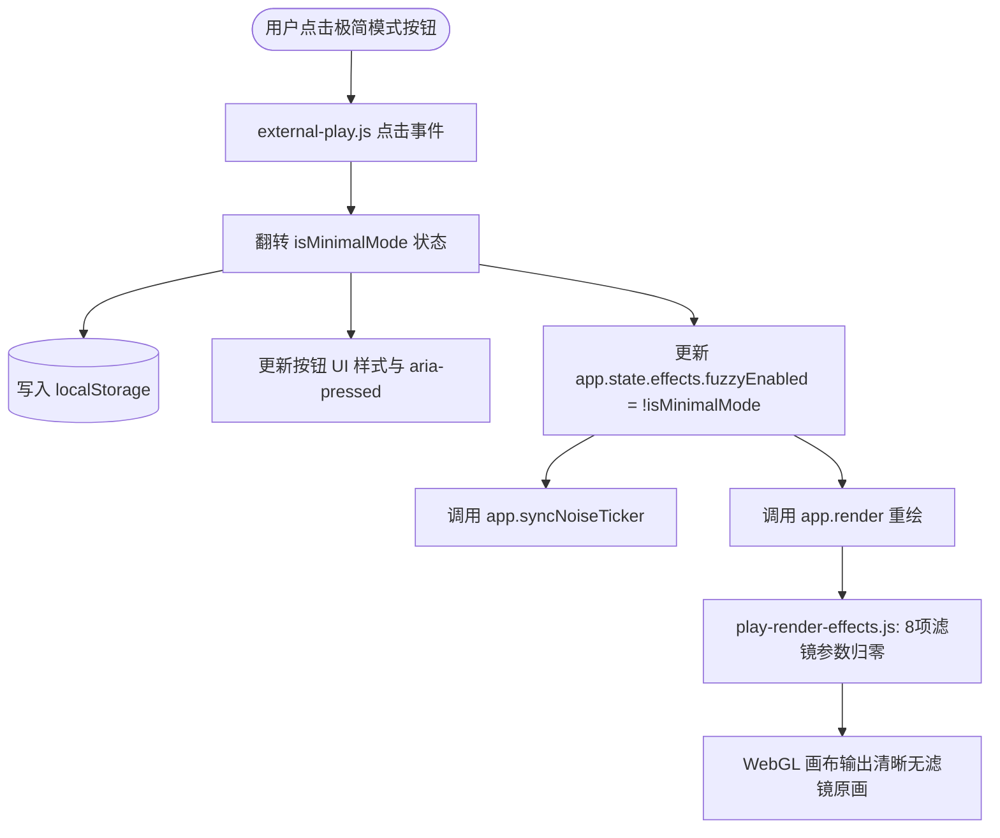

# 观战界面「极简模式」设计规范

**日期**：2026-09-03  
**状态**：已评审通过  
**目标**：在 MazeBench 实时观战页面（External Play Spectator）中增加「极简模式」切换开关，开启后彻底关闭 Softness、Bloom、Bleed、Scanlines、Mask、Ghosting、Vignette、Noise 等 8 项 CRT/Fuzzy 着色器滤镜，保留 3D 轮廓描边，并持久化用户偏好到 `localStorage`。

---

## 一、需求背景与目标

当前 MazeBenchEngine 观战页面（`/external-play/:runId`）复用了核心游玩引擎的渲染管线。由于页面模板中未配置 `#fuzzy-toggle` 按钮，着色器特效总闸 `app.state.effects.fuzzyEnabled` 默认被强制设为 `true`。这使得画面始终带有模拟复古显像管（CRT）的模糊、泛光、色溢、扫描线、暗角和噪点效果。

为了满足用户对清晰锐利视觉体验的诉求，现需在观战页面增加「极简模式」功能：
1. **纯净画面**：关闭 8 项 WebGL 着色器后处理滤镜，画面原画透传，清晰锐利。
2. **边缘保留**：保留 3D 物体与几何体的黑色描边轮廓（Toon Outline），维持极佳的空间辨识度。
3. **便捷交互**：在观战底部回放控制栏右侧放置切换按钮，点击即时生效无刷新。
4. **状态持久化**：使用 `localStorage` 记住偏好，页面刷新或切换会话保持所选模式。

---

## 二、架构设计与模块变更



### 1. 前端模板层（`server/pages.js`）
- 在 `renderExternalPlayRunPage` 的底部回放栏右侧（`.playback-controls-right`）新增切换按钮：
  ```html
  <button id="playback-minimal-btn" class="playback-btn playback-btn--toggle" type="button" title="Toggle Minimal Mode" aria-pressed="false" data-i18n="minimal_mode_btn">✨ 极简模式</button>
  ```
- 确保服务端渲染时包含国际化属性。

### 2. 国际化字典层（`public/i18n.js` & `environments/.../public/i18n.js`）
- 中文字典增加：`minimal_mode_btn: "极简模式"`
- 英文字典增加：`minimal_mode_btn: "Minimal Mode"`

### 3. 样式层（`public/external-play.css`）
- 为 `.playback-btn--toggle` 增加默认态与激活态样式：
  - 默认态（未激活，滤镜开启）：与现有播放控制按钮保持一致风格（半透明深色微边框）。
  - 激活态（极简模式开启）：添加 `.is-active`，展示高亮边框和主题微光（青色/深蓝高亮，与 Live 按钮呼应），并更新 `aria-pressed="true"`。

### 4. 运行时逻辑层（`public/external-play.js`）
- **常量定义**：
  - `STORAGE_KEY_MINIMAL_MODE = "mazebench_spectator_minimal_mode"`
- **初始化流程**：
  - 页面启动或获取到 `window.__PLAY_APP__` 时，从 `localStorage` 读取 `STORAGE_KEY_MINIMAL_MODE`。
  - 若存储值为 `"true"`，则立即将 `app.state.effects.fuzzyEnabled` 设置为 `false`，并为按钮添加 `.is-active` 与 `aria-pressed="true"`。
  - 同步调用 `app.syncNoiseTicker()` 避免无意义的噪点定时器空转。
- **点击交互绑定**：
  - 监听 `#playback-minimal-btn` 的 `click` 事件。
  - 计算 `nextMinimal = !currentMinimal`。
  - 将 `app.state.effects.fuzzyEnabled = !nextMinimal`。
  - 更新按钮 `.is-active` 类名及 `aria-pressed` 属性。
  - 更新文本/标题提示（或利用 CSS 状态伪类渲染）。
  - 存入 `localStorage.setItem(STORAGE_KEY_MINIMAL_MODE, String(nextMinimal))`。
  - 触发 `app.syncNoiseTicker()` 和 `app.render()` 实现 0 延迟即时重绘。

---

## 三、渲染管线与特效联动细节

当极简模式激活（`fuzzyEnabled = false`）时，各视觉系统表现如下：

1. **8 项 WebGL 着色器参数（`public/play-render-effects.js`）**：
   - `bleed = 0`
   - `bloom = 0`
   - `softness = 0`
   - `scanlines = 0`
   - `mask = 0`
   - `ghosting = 0`
   - `noise = 0`
   - `vignetteStrength = 0`
   - 片元着色器采样 `sampleSource(v_uv)` 原色并直接输出，不进行任何卷积柔化或颜色失真。

2. **3D 黑色轮廓描边（`public/play-render-three.js`）**：
   - `edgeOutlinesEnabled` 维持默认 `true`，不受极简模式影响，确保 3D 方块和迷宫墙壁清晰立体。

3. **噪点循环器（Noise Ticker）**：
   - `app.syncNoiseTicker()` 在 `fuzzyEnabled = false` 时会自动取消 `requestAnimationFrame` 循环，降低页面闲置 GPU/CPU 占用。

---

## 四、错误处理与容错机制

1. **localStorage 权限异常容错**：在无痕浏览或安全策略限制时，包裹 `try...catch`，降级为单次会话内有效，不抛出未捕获异常。
2. **引擎未初始化容错**：如果按钮在 `window.__PLAY_APP__` 完全挂载前被点击，等待就绪后再应用状态。
3. **多标签页同步**：可选监听 `storage` 事件，若用户在另一个观战标签页切换，本页面自适应同步更新。

---

## 五、验证与测试计划

1. **UI 元素呈现测试**：
   - 检查观战页面底部回放条右侧是否存在 `#playback-minimal-btn`。
   - 检查中英文国际化语言切换时按钮文案是否正确渲染。
2. **功能与着色器状态测试**：
   - 默认加载时：检查 `app.state.effects.fuzzyEnabled` 与按钮状态。
   - 点击切换：断言 `app.state.effects.fuzzyEnabled` 变为 `false`，着色器输出纯净原画。
   - 再次点击：断言恢复为 `true`，CRT 滤镜平滑恢复。
3. **持久化测试**：
   - 切换为极简模式后刷新页面，断言重新加载后自动处于极简模式。
4. **无视觉副作用测试**：
   - 验证 3D 轮廓描边依然正常显示。
   - 验证回放条拖动（Scrubber）、历史步骤步进（Prev/Next）在极简模式下正常渲染无断帧。
